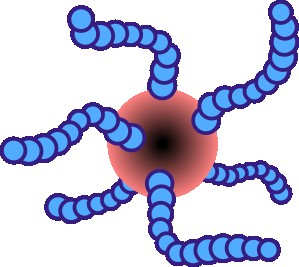
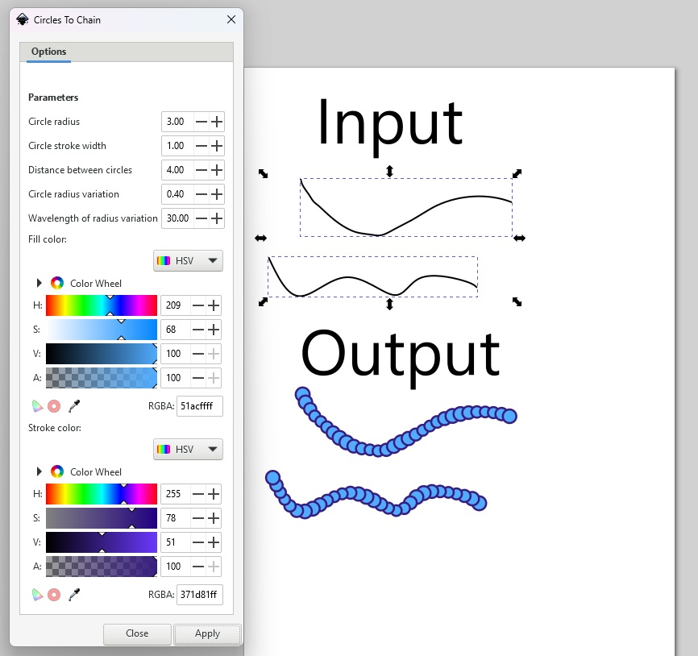

# Polymer	

A simple Inkscape extension for making a series of circles over a path - to look like a polymer. 

## Usage 

Select one or more paths. 

Select **Extensions->Polymer->Circles to Chain..**. 

Set parameters (see figure below)

Each path will be covered with circles in their own group. 

## Installation 

Unzip the folder into your extensions folder and then make the following change to your preferences in Inkscape: 

IMPORTANT: In **Input/Output->SVG output**, set *Path string format* to *Relative* and check *Force repeat commands*.

**Tested on Inkscape 1.2.2 .**

